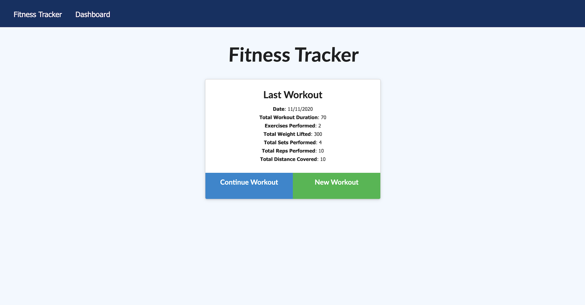

# Unit 17 Nosql Homework: Workout Tracker

A workout tracker that allows uers to create and track their daily workout. You can enter multiple exercises to keep a log for your workout on a given day. Track the name, type, weight, sets, reps and distance for different types of exercises.

- - -

## Overview

A consumer will reach their fitness goals more quickly when they track their workout progress. Having the ability to track progress gives the user an insight into activity and provides positive reinforcement for progress.

[Live Application](https://whispering-retreat-67293.herokuapp.com/?id=5facc31a5b3e230017056a95)



- - -

## Initial Installation
Copy the repo with complted code and information. Once on your local machine use the following command in your terminal:

```
npm install 
```
- with no paramerters will just be sure you pull down dependancies listed in the json file
- only run if there are existing dependancies in the json file

All dependanies are listed within the package.json file so they will install automatically. If you run into any missed dependancies or want to add some of your own custom code use the following command: 
```
npm install (package name)
```
- run for other dependancies
- Just add in each package with the name of the package

- - -

## Creating Live Applicaition
To send live, you will need to create a MongoDB Atlas account and connect a batabase from there to your application. Once you have your Atlas account you will connect this to Heroku.

- - -

## Hosting on Heroku

The app is hosted by Heroku and can be viewed here: [Live Application](https://whispering-retreat-67293.herokuapp.com/?id=5facc31a5b3e230017056a95)

- - -

#### Contributor
##### Ashley Hunt
##### * [GitHub](https://github.com/ashhunt07)
##### * [Contact](https://ashhunt07.github.io/portfolio/contact.html)
